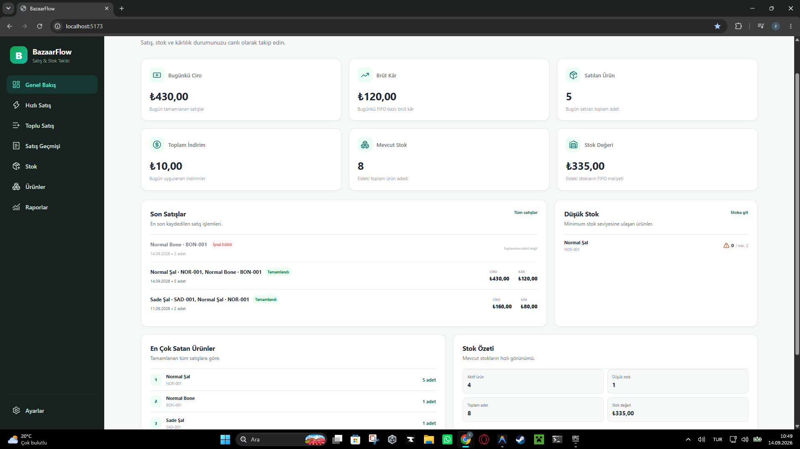
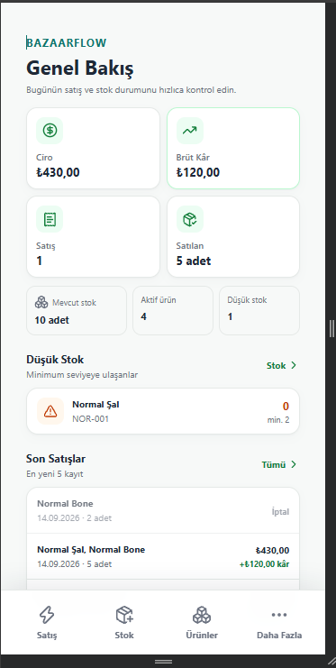
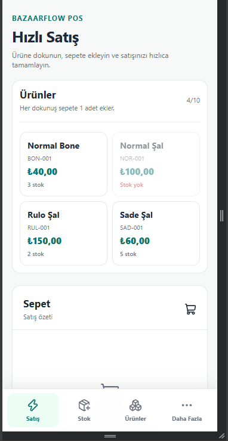
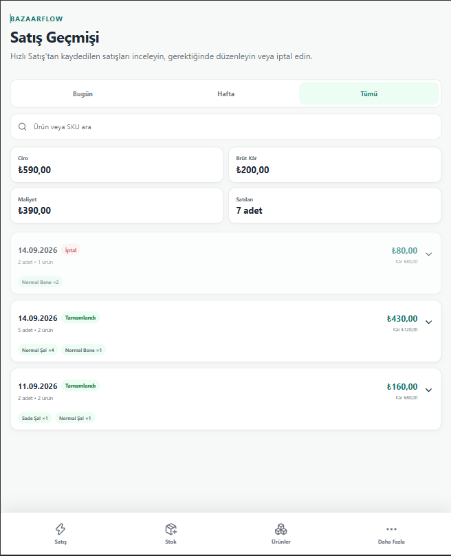

# BazaarFlow

**BazaarFlow**, küçük ve orta ölçekli satış operasyonları için geliştirilmiş, tarayıcı üzerinde çalışan **local-first satış, stok ve kârlılık takip uygulamasıdır**.

React + TypeScript ile geliştirilmiştir. Veriler sunucu gerektirmeden cihazdaki IndexedDB veritabanında tutulur; stok maliyetleri FIFO yöntemiyle izlenir ve satışlardan gerçek brüt kâr hesaplanır.

> **Sürüm:** v0.1.0<br>
> **Veri modeli:** Local-first / IndexedDB<br>
> **Maliyetlendirme:** FIFO

## Ekran görüntüleri

### Masaüstü



### Mobil

<p align="center">
  
  &nbsp;
  
  &nbsp;
  
</p>

## Özellikler

- Ürün ve kategori yönetimi
- Ürün bazında minimum stok seviyesi
- Aynı ürün için farklı maliyetli stok partileri
- Normal stok alımı ve açılış stoku
- Manuel stok artırma / azaltma düzeltmeleri
- FIFO maliyetlendirme
- Hızlı satış ekranı
- Geçmiş tarihli / toplu satış
- Satış sırasında özel fiyat girişi
- Sepet toplamını hedef tutara yuvarlama
- Sepet indiriminin satış kalemlerine oransal dağıtımı
- Satış düzenleme ve iptal
- İptal edilen satışlarda stokların yeniden oluşturulması
- Geriye dönük satışlarda kronolojik FIFO yeniden hesaplama
- Ciro, FIFO maliyeti ve brüt kâr takibi
- Günlük, haftalık, aylık, yıllık ve özel tarih raporları
- Ürün performansı ve en çok satan / en kârlı ürünler
- Stok değeri ve düşük stok uyarıları
- JSON yedekleme ve geri yükleme
- Tamamlanan satışları CSV olarak dışa aktarma
- Masaüstü ve mobil için ayrı optimize edilmiş arayüzler
- Mobil alt navigasyon ve hızlı stok girişi
- Klavye erişilebilirliği olan onay pencereleri
- Bilinmeyen adresler için 404 ekranı
- Route tabanlı lazy loading

## Nasıl çalışır?

BazaarFlow'da stok maliyeti ürün üzerinde tek bir değer olarak tutulmaz. Her stok girişi ayrı bir **stok partisi** oluşturur.

Örnek:

| Tarih | Ürün | Adet | Birim maliyet |
| --- | --- | ---: | ---: |
| 10.09.2026 | Normal Şal | 2 | ₺50 |
| 12.09.2026 | Normal Şal | 3 | ₺80 |

4 adet satış yapıldığında FIFO sırasıyla önce eski partiyi tüketir:

- 2 × ₺50
- 2 × ₺80
- FIFO maliyeti: **₺260**

Böylece stok farklı alış fiyatlarından alınsa bile satış kârlılığı doğru maliyet üzerinden hesaplanır.

Geriye dönük satış veya stok düzeltmesi yapıldığında FIFO geçmişi kronolojik olarak yeniden oluşturulur.

## Local-first veri yapısı

BazaarFlow v0.1.0'da hesap veya sunucu gerektirmez. Veriler tarayıcının **IndexedDB** alanında saklanır.

Bunun iki önemli sonucu vardır:

1. Uygulama verileri ilgili tarayıcı ve cihaza aittir.
2. Tarayıcı verileri silinmeden önce düzenli **JSON yedeği** alınması önerilir.

Ayarlar ekranından tam veri yedeği indirilebilir ve daha sonra aynı uygulamaya geri yüklenebilir.

## Masaüstü ve mobil deneyim

BazaarFlow tek arayüzü küçültmek yerine kullanım senaryosuna göre farklı ekranlar sunar.

### Masaüstü

- Ayrıntılı stok yönetimi
- Stok parti geçmişi
- Stok düzeltmeleri
- Toplu / geçmiş tarihli satış
- Geniş dashboard ve grafik raporları

### Mobil

- Hızlı Satış
- Hızlı stok girişi
- Ürün yönetimi
- Mobil satış geçmişi
- Kompakt raporlar
- Genel Bakış ve Ayarlar

Mobil breakpoint: **768 px ve altı**.

## Teknolojiler

| Teknoloji | Kullanım |
| --- | --- |
| React 19 | Arayüz |
| TypeScript | Tip güvenliği |
| Vite 8 | Geliştirme ve production build |
| React Router | Sayfa yönlendirme |
| Dexie | IndexedDB veri katmanı |
| Recharts | Rapor grafikleri |
| Lucide React | İkonlar |
| Oxlint | Kod kalitesi |

## Kurulum

### Gereksinimler

- Node.js
- npm
- Modern bir Chromium / Firefox / Safari tabanlı tarayıcı

### Projeyi çalıştırma

```bash
git clone https://github.com/zahidkaya1/BazaarFlow.git
cd BazaarFlow
npm install
npm run dev
```

Vite geliştirme sunucusu varsayılan olarak:

```text
http://localhost:5173
```

adresinde açılır.

## Komutlar

```bash
# Geliştirme sunucusu
npm run dev

# Kod kalite kontrolü
npm run lint

# Production build
npm run build

# Production build'i yerelde önizleme
npm run preview
```

## Proje yapısı

```text
src/
├── components/      Ortak arayüz bileşenleri
├── db/              Dexie / IndexedDB veritabanı
├── pages/           Masaüstü ve mobil ekranlar
├── services/        Satış, stok, FIFO, yedekleme ve veri servisleri
├── types/           TypeScript veri modelleri
├── utils/           Para, tarih, yuvarlama ve sıralama yardımcıları
├── App.tsx          Route yapısı
├── main.tsx         Uygulama başlangıcı
└── index.css        Ortak ve responsive stiller
```

Temel iş kuralları `services` katmanında tutulur. Mobil ve masaüstü ekranlar aynı satış / stok / FIFO servislerini kullanır; iş mantığı arayüz katmanlarında kopyalanmaz.

## Finansal hesaplama

BazaarFlow üç temel değeri ayrı tutar:

- **Ciro:** satıştan elde edilen gerçek gelir
- **FIFO maliyeti:** satılan ürünlerin stok partilerinden gelen gerçek maliyeti
- **Brüt kâr:** `ciro - FIFO maliyeti`

Sepet yuvarlama indirimi kullanıldığında indirim satış kalemlerine oransal dağıtılır. Böylece ürün bazlı ciro ve brüt kâr raporları sepet toplamıyla tam olarak eşleşir.

## Yedekleme ve dışa aktarma

### JSON yedeği

JSON yedeği uygulamanın temel kayıtlarını saklar:

- kategoriler
- ürünler
- stok partileri
- satışlar
- satış kalemleri
- stok düzeltmeleri

FIFO allocation kayıtları türetilmiş veri olduğu için geri yükleme sırasında işlem geçmişinden yeniden oluşturulur.

### CSV

CSV dışa aktarma yalnızca tamamlanmış satışları içerir ve gelir / indirim / FIFO maliyeti / brüt kâr verilerini dışa aktarır.

## v0.1.0 kapsamı dışında

İlk sürüm bilinçli olarak sade tutulmuştur. Şu özellikler v0.1.0 kapsamında değildir:

- Kullanıcı hesabı / yetkilendirme
- Bulut veritabanı ve cihazlar arası senkronizasyon
- Çoklu mağaza
- Personel rolleri
- Barkod sistemi
- Fatura / e-fatura
- Müşteri ve tedarikçi CRM'i
- Ödeme altyapısı
- E-ticaret entegrasyonu

## Veri güvenliği

Uygulama önemli işlemlerde şu davranışları uygular:

- Satış oluşturma, düzenleme ve iptal işlemleri transaction içinde çalışır.
- Geriye dönük işlemler FIFO sırasını yeniden oluşturur.
- Satış iptalinde kayıt silinmez; `cancelled` olarak saklanır.
- Kritik formlarda çift tıklamayla çift kayıt oluşmasını önleyen işlem kilitleri vardır.
- JSON geri yükleme mevcut verileri değiştirmeden önce açık onay ister.

## Sürüm geçmişi

Değişiklikler için [CHANGELOG.md](CHANGELOG.md) dosyasına bakın.

v0.1.0 sürüm notları: [docs/RELEASE_NOTES_v0.1.0.md](docs/RELEASE_NOTES_v0.1.0.md)

---

**BazaarFlow v0.1.0** — satış, stok ve FIFO kârlılığını tek yerde takip etmek için.
